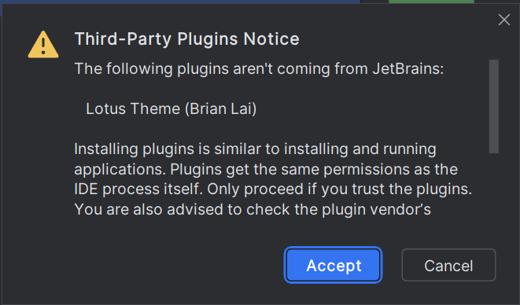

# Proceso de instalación y de configuración de PyCharm Community Edition en Windows

Una vez abramos PyCharm por primera vez, veremos que nos sale la siguiente splash screen:

Enhorabuena, has instalado PyCharm. Ahora **vamos a configurarlo**.

## Configuración inicial de PyCharm

Durante la primera ejecución de PyCharm, veremos que tenemos que **aceptar el contrato de licencia open-source** de PyCharm CE. Lo aceptamos y **presionamos continuar**.

Tras aceptar el contrato de licencia, nos aparecerá una pantalla que nos sugiere que enviemos datos de telemetría a JetBrains, aunque esto es preferencia personal, yo le dí a que no, es decir, **el botón gris**.

Una vez hecho eso, veremos la pantalla inicial de PyCharm. Enhorabuena, **has instalado tu IDE**.

Lo primero que haremos será crear un proyecto, en el que tú escribirás tus notas. Hacemos click en el botón de nuevo proyecto. Elegimos a la izquierda "Python Puro". 
Ahora, elegimos la localización de nuestro proyecto, es decir, donde se almacenarán los archivos. Aparte, queremos el proyecto vacío, por tanto, desmarcamos las casillas de *"crear repositorio de git"* y *"crear script de bienvenida"*.

Tras ello, si me has hecho caso y has instalado Python primero, verás que podrás elegir la versión de Python debajo del seleccionable de *"tipo de intérprete"*.

Recomiendo leer [la nota aclaratoria](#nota-aclaratoria) antes de continuar.

## Interfaz de PyCharm

PyCharm tiene una interfaz muy moderna, la cual ha sido actualizada recientemente en la versión 2024.2. En el panel izquierdo tenemos varios iconos, pero el que nos importa es el de proyecto, es decir, el que está seleccionado por defecto.

Ahora, nos dirigiremos al menú de opciones. Está en la esquina superior derecha, al lado de los botones de acción. Haremos click en *"settings"* u *"opciones"*.

<div\>

Una vez hagamos click en el menú de opciones, nos dirigiremos en el panel izquierdo a la pestaña de *"plugins"*. Mis recomendaciones de plugins a instalar son:

- Tema Lotus
- Tema Celestial
- Better Comments

Una vez le demos a instalar al plugin de nuestro gusto, se nos preguntará si estamos seguros de instalar el plugin, ya que el plugin no está desarrollado por JetBrains. Yo instalaré el tema Lotus.

Cuando el plugin se termine de instalar, volveremos a la pestaña de apariencia de la barra izquierda y elegiremos nuestro tema recién instalado

Felicidades, has completado la configuración de PyCharm. Ahora, te recomiendo que te pases por [el siguiente archivo](test.md) para comprobar que funciona todo correctamente.

## Nota aclaratoria

Python trabaja con entornos virtuales, es decir, cuando tu corres un archivo python, la mejor práctica es hacerlo desde un entorno virtual, ya que aislas todos los paquetes y librerías que vayas a usar de tu python original.

Un entorno virtual es una instalación de python completamente aislada del resto de instalaciones, la cual reside en una carpeta de tu proyecto, normalmente está escondida por el punto del principio (".venv"), aunque PyCharm **nos la muestra**.
