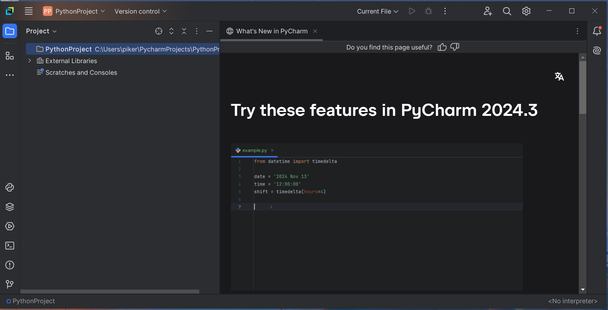

# Proceso de instalación y de configuración de PyCharm Community Edition en Windows

## Pruebas de funcionamiento

Lo primero que comprobaremos será si se ha instalado tu entorno virtual. Para ello, echaremos un vistazo a la parte inferior derecha de nuestro IDE para ver si se nos ha seleccionado el intérprete correcto. Hay dos posibilidades:

- No has instalado Python antes de instalar PyCharm. Dirígete a [el archivo de instalación de python](#crear-entorno-virtual) para instalar python y vuelve al [siguiente apartado](#crear-entorno-virtual) para crear tu entorno virtual. (Imagen superior)
  - Aparece *"< No interpreter >"* en la parte inferior derecha
  - No hay una carpeta llamada *".venv"* en la pestaña proyecto
- Instalaste Python antes de PyCharm y por tanto hay una carpeta *".venv"* resaltada en naranja en la pestaña proyecto. Continúa a las [pruebas de uso](#primer-programa). (Imagen inferior)
  - Aparece "Python 3.x ()" en la parte inferior derecha, dónde x es la versión que te has descargado de Python3 y el texto entre paréntesis es el nombre que le has dado a tu proyecto
  - Hay una carpeta llamada *".venv"*, está resaltada en un color amarillo-naranja y contiene muchos archivos dentro

<div>


<div\>

### Crear entorno virtual

Esta sección te la puedes saltar en caso de que tu IDE se vea como la segunda imagen de antes, ya que tu entorno virtual ha sido creado automáticamente.

Para empezar creando nuestro entorno virtual, tendremos que instalar Python. En [este archivo](../../py/install.md) te explico cómo hacerlo. Ábrelo en una pestaña nueva, ya que tendrás que volver cuando hayas terminado.

Ahora, una vez hayas instalado python, iremos a la parte inferior derecha, dónde dice "< No interpreter >" y haremos click. Se nos desplegará un menú, y le daremos a "< No interpreter > -> Add new interpreter -> Add local interpreter...".


Se nos abrirá un menú, en el cual dejaremos todo con las opciones por defecto y le daremos click en "OK".


Una vez hecho eso, te recomiendo que compruebes tu IDE para que se vea como en el [apartado anterior](#pruebas-de-funcionamiento). Si es el caso, felicidades, has creado tu primer entorno virtual de forma semi-automática. Una vez hagas la comprobación, puedes pasar al [siguiente apartado](#primer-programa).

### Primer programa

Ahora, vengas de dónde vengas, podemos empezar a escribir Python. Este lenguaje tiene la extensión de archivo *".py"*. Acostúmbrate, ya que lo veremos por todas partes. Los archivos *.py* no tienen nada de especial, solamente son archivos de texto con una extensión diferente para marcar una diferencia. Para crear nuestro primer archivo python, haremos click derecho sobre nuestra carpeta de proyecto, seguiremos a "Click derecho -> New -> Python file"


Una vez lo seleccionemos, se nos abrirá un menú en el que tendremos que elegir el nombre de nuestro archivo. No pongas la extensión, ya que PyCharm la escribe automáticamente. El archivo principal de un programa python es *"[main.py](../../../../main.md)"*.


Cuando creemos nuestro archivo, nos encontraremos con lo siguiente: un editor de texto con un archivo vacío, y podremos ver también que a la izquierda se habrá creade nuestro archivo *[main.py](../../../../main.md)*.


Ahora, escribiremos lo siguiente:

```python
print("hola mundo")
```

Este será el código de nuestro mejor programa, el cual iremos explicando en próximos archivos.


Aparte, el botón verde de *"play"* de nuestro editor se habrá resaltado, lo cual quiere decir que **pycharm está listo para ejecutar nuestro código**. 


Hacemos click en el botón y se nos abrirá la salida de texto de nuestro programa y podremos ver que, si ha salido todo bien, **la salida del programa será "hola mundo"**.


# Has completado la instalación de PyCharm.
Para continuar, dirígete al [archivo 1 de teoría de python](../../../bloque1/001_variables.md), donde te explicaré los conceptos básicos.
