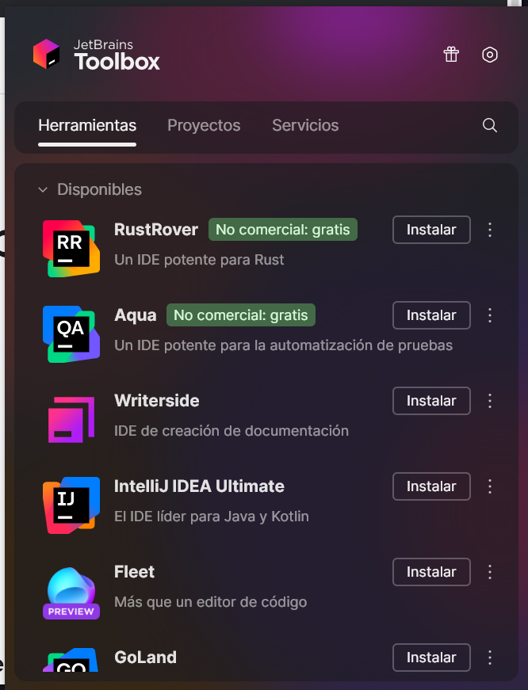
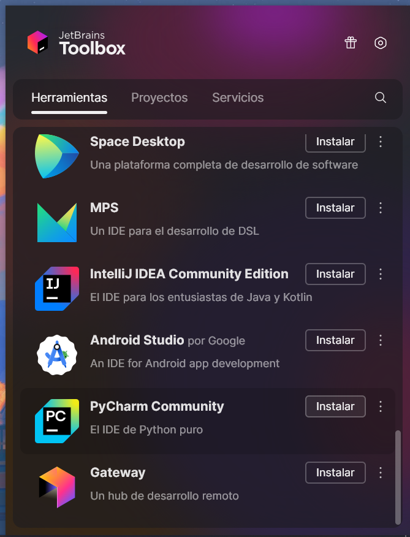
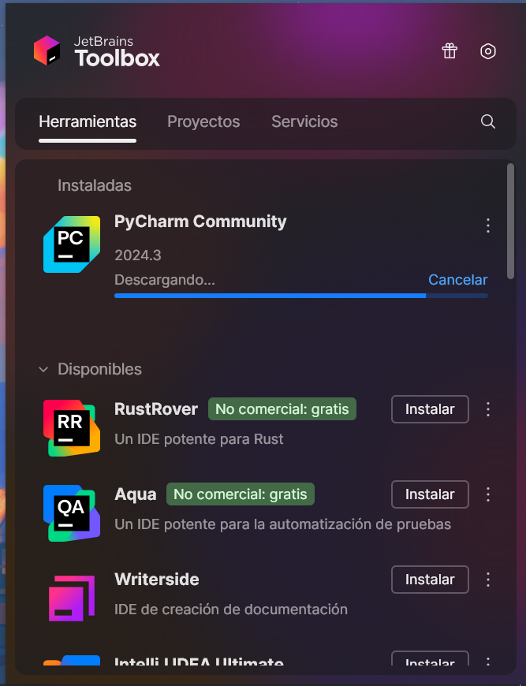

# Proceso de instalación y de configuración de PyCharm Community Edition en Windows

## Configuración de la Toolbox de JetBrains

Una vez ejecutemos el instalador, lo primero que veremos será una página que nos dará la bienvenida a nuestra nueva aplicación. Para continuar, te recomiendo que desactives la telemetría **no tocando la checkbox de abajo**. Una vez dicho eso, hacemos click en el botón de "Install".

Esperaremos a que se instale y una vez instalado, tendremos nuestra toolbox en la bandeja de aplicaciones abajo a la derecha, junto a la hora. Abrimos la Toolbox y comenzará el proceso de configuración. En primer lugar, nos pide por aceptar el contrato de licencia de los productos de JetBrains, marcamos la casilla y desmarcamos la casilla de la telemetría. Aparte, puedes cambiar el idioma a la derecha del botón azul de continuar.

<div\>

Una vez cambiado el idioma y aceptado el contrato de licencia, le damos a continuar y veremos la página principal de nuestra Toolbox.

Ahora, vamos a instalar nuestro IDE. Hay dos versiones de PyCharm:

- Pycharm Professional
- PyCharm Community Edition

Nosotros vamos a instalar PyCharm Community Edition. Importante que no confundas, ya que cuando instalas PyCharm Professional comienza tu prueba gratuita de 30 días, tras ello, se desactiva tu entorno de desarrollo y no te permite el acceso más. A la izquierda tienes un ejemplo de PyCharm Professional y a la derecha un ejemplo de PyCharm CE. Por regla general, nuestro PyCharm se encuentra al final.

<div\>

Hacemos click en el botón de instalar una vez encontremos PyCharm Community Edition, y volvemos arriba del todo, dónde lo veremos instalando.

Una vez se acabe de instalar PyCharm, hacemos click para abrirlo y pasaremos a la configuración inicial de PyCharm [en este archivo](../PyCharm/conf.md).