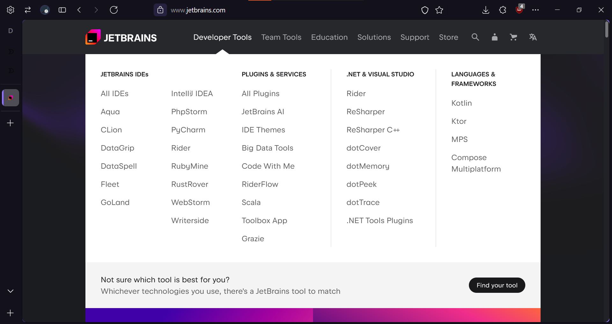
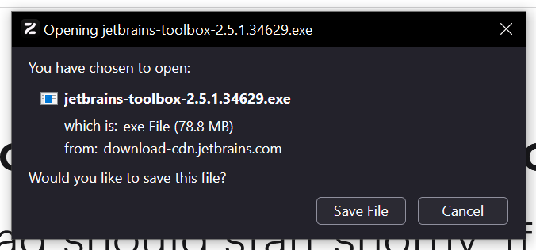

# Proceso de instalación y de configuración de PyCharm Community Edition en Windows

## Instalación de la Toolbox de JetBrains

PyCharm Community Edition es difícil de encontrar en la [página de JetBrains](https://jetbrains.com), por tanto, lo que haremos será instalar PyCharm CE desde la ToolBox que nos proporcionan los de JetBrains. Este programa nos permite usar cualquier herramienta de esta compañía, por tanto, resulta muy útil si trabajas a menudo con ello.

Para instalar PyCharm CE en windows, nos dirigiremos a [jetbrains.com](https://jetbrains.com), y clicaremos en el botón de "Developer Tools".

Una vez en la página de developer tools nos dirigiremos al penúltimo link de la tercera columna "Plugins and Services", es decir, haremos click donde dice **"Toolbox App"**.

Una vez hagas click en el hipervínculo de "Toolbox App", estaremos en la página de la Toolbox de JetBrains. Ahora, nos descargaremos nuestro instalador, el cual es un ejecutable *.exe*.

Una vez te descargues el instalador, haz doble click para instalarte la Toolbox de JetBrains en tu ordenador, y ahora pasaremos a configurarla [en este archivo](conf.md#).

